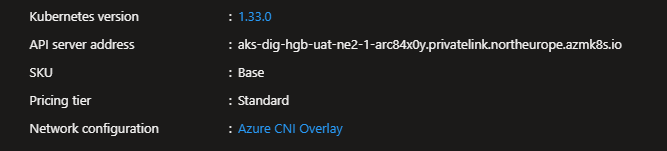

# Private AKS cluster with customer-managed Private DNS zone

This document provides guidance on how to provision a private Azure Kubernetes Service (AKS) cluster with a customer-managed private DNS zone, ensuring that the cluster's API server is accessible only within a specified Virtual Network (VNet). Preference for private dns zone is optional, but encouraged as it guarantees traffic to the API server do not traverse the network.

## Security impact
- Control plane is accessible only via a private endpoint in your VNet; public API server endpoint is disabled. This reduces internet exposure of the API server and attack surface.
- All kubectl/management access must come from within the VNet (bastion/jumpbox, VPN, ExpressRoute) or via a peered/linked network; plan secure access, auditing and jump hosts accordingly.
- Nodes and service endpoints remain in your VNet; network controls (NSGs, route tables) and Azure policy apply to pod/node traffic.
- Using a customer-managed private DNS zone gives you control of DNS records and lifecycle (and visibility into DNS changes) but requires you to create/link the correct zone before cluster creation so the AKS control plane can use it.

## Prerequisites
- Azure CLI (latest) and logged in: az login
- Target subscription selected: az account set --subscription <SUBSCRIPTION_ID>
- Existing Resource group, virtual network and subnet with sufficient IP space for node pools and Kubernetes service CIDRs.
- Decide region (LOCATION) and create a private DNS zone named exactly privatelink.<LOCATION>.azmk8s.io (e.g., privatelink.northeurope.azmk8s.io) in your subscription/resource group and link it to the VNet prior to AKS creation.
- Managed Identity with permissions to link private DNS zones and create dns records (private DNS Zone Contributor).

Example az CLI commands (replace placeholders)
## variables
```bash
LOCATION=<location>                # e.g., northeurope
RG=<resource-group>
VNET_NAME=<vnet-name>
SUBNET_NAME=<subnet-name>
DNS_ZONE=privatelink.$LOCATION.azmk8s.io
```


## capture resource ids
Sometimes maybe your vnet, private dns zone or any other resource are in separate resource groups or even subscriptions. Simply using a name will not work, instead use resource ids for this.
```bash
SUBNET_ID=$(az network vnet subnet show -g $RG --vnet-name $VNET_NAME -n $SUBNET_NAME --query id -o tsv)
```

## create customer-managed private DNS zone and link it to the VNet BEFORE creating AKS
```bash
az network private-dns zone create -g RG -n $DNS_ZONE
$DNS_ZONE_ID=$(az network private-dns zone show -g $RG -n $DNS_ZONE --query id -o tsv)
```

### link the DNS zone to the VNet (use VNet id to be explicit)
```bash
VNET_ID=$(az network vnet show -g $RG -n $VNET_NAME --query id -o tsv)
az network private-dns link vnet create -g $RG -z $DNS_ZONE -n dnsLinkToVnet \
    --virtual-network $VNET_ID --registration-enabled false
```

## create a private AKS cluster that will use the pre-created privatelink zone
```bash
az aks create \
            --resource-group "rg-sws-mto-dev-ne2-2" \
            --name "aks-pls-gwh-dev-ne2-1" \
            --kubernetes-version 1.33.0 \
            --nodepool-name nodepool \
            --enable-cluster-autoscaler \
            --min-count 1 \
            --max-count 3 \
            --pod-cidr 192.168.0.0/16 \
            --network-plugin "azure" \
            --network-policy "azure" \
            --network-plugin-mode "overlay" \
            --vnet-subnet-id "$SUBNET_ID" \
            --dns-service-ip 10.2.0.10 \
            --service-cidr 10.2.0.0/16 \
            --enable-private-cluster \
            --enable-addons azure-policy \
            --tags MKP="AKS" \
            --enable-azure-rbac \
            --enable-aad \
            --disable-local-accounts \
            --no-ssh-key \
            --disable-public-fqdn \
            --private-dns-zone "$DNS_ZONE_ID" \
            --assign-identity "name or resource id of managed identity with priviliges"
```

## Verify the AKS cluster API server address ends with the suffix of the private DNS zone you created



Notes
- Creating the private DNS zone with the exact AKS expected name (privatelink.<location>.azmk8s.io) and linking it to the VNet before cluster creation causes AKS to use your customer-managed zone instead of creating a Microsoft-managed zone.
- If your DNS zone or link is in a different subscription/resource group, ensure cross-subscription permissions are granted.
- After creation, use a jump host or private bastion inside the VNet to run kubectl (az aks get-credentials --resource-group $RG --name $AKS_NAME --admin will require access via the private endpoint).
