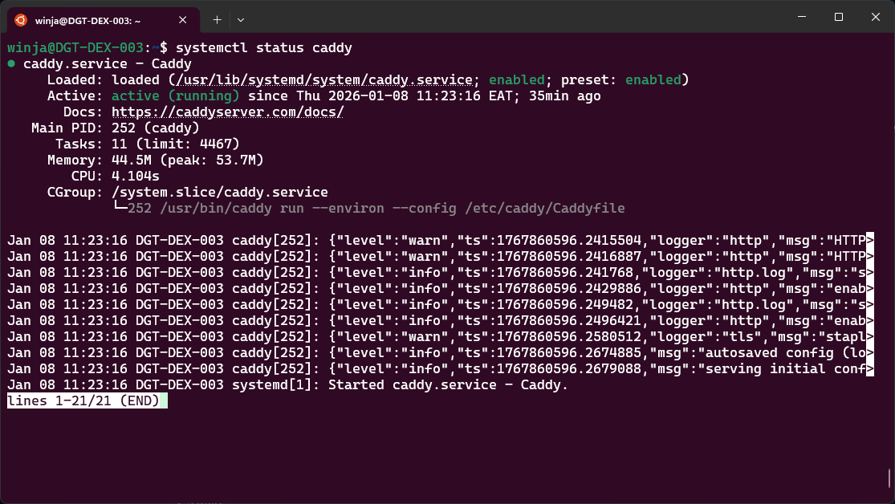
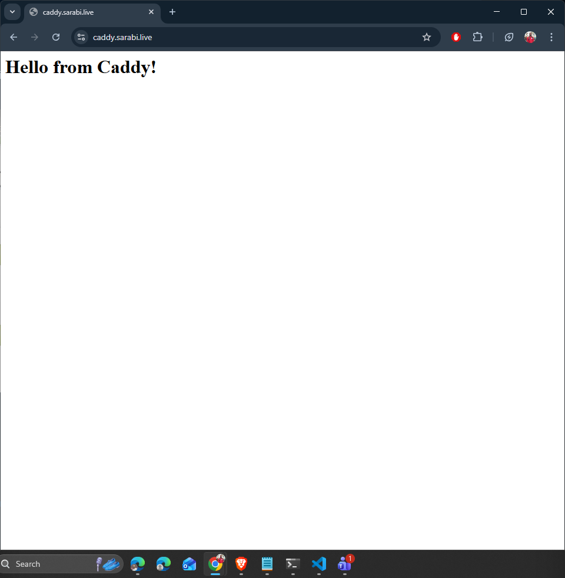

# Using Caddy as a Web Server (with Automatic HTTPS)

Caddy is a modern, secure-by-default web server and reverse proxy known for **automatic HTTPS** (via Let’s Encrypt) and a very simple configuration model (`Caddyfile`). Caddy offers more than just automated HTTPS which is what we explore in this docs. It offers almost all capabilities available with Nginx including Ingress Controller for Kubernetes.


## Why Caddy

- **Automatic HTTPS**: Certificates are issued and renewed automatically.
- **Simple configuration**: Minimal `Caddyfile` to get started.
- **Zero-downtime reloads**: Apply config changes seamlessly.
- **Built-in reverse proxy**: Easy to front microservices.
- **Secure defaults**: TLS, modern ciphers, sensible headers.


## Prerequisites

- A **public server** with ports **80 (HTTP)** and **443 (HTTPS)** reachable.
- A **domain name** you control (e.g., `example.com`).
- An **A/AAAA DNS record** pointing your domain/subdomain to your server’s IP.
- For firewalls/security groups, allow inbound **80/tcp** and **443/tcp**.

## Install Caddy  Debian/Ubuntu
Docs for installation and supported OS: https://caddyserver.com/docs/install
```bash
sudo apt install -y debian-keyring debian-archive-keyring apt-transport-https curl
curl -1sLf 'https://dl.cloudsmith.io/public/caddy/stable/gpg.key' | sudo gpg --dearmor -o /usr/share/keyrings/caddy-stable-archive-keyring.gpg
curl -1sLf 'https://dl.cloudsmith.io/public/caddy/stable/debian.deb.txt' | sudo tee /etc/apt/sources.list.d/caddy-stable.list
chmod o+r /usr/share/keyrings/caddy-stable-archive-keyring.gpg
chmod o+r /etc/apt/sources.list.d/caddy-stable.list
sudo apt update
sudo apt install caddy
```
This installs the systemd service (`caddy.service`) and sets up default directories. Verify installation and that the service is up and running

```bash
caddy version
systemctl status caddy
```



## First HTTPS static site
For a simple getting started site, you can follow this guide: https://caddyserver.com/docs/quick-starts/https

Sample static site. Update this with your static file contents

```bash
sudo mkdir -p /var/www/sarabi
sudo chown -R $USER:$USER /var/www/sarabi
echo "<h1>Hello from Caddy</h1>" > /var/www/sarabi/index.html
```
Getting started with caddy configuration is quite easy. The defaults in the Caddyfile need minimal updating to get started.
The Caddyfile by default is located in the /etc/caddy/Caddyfile. Getting started is as simple as replacing the :80 to your domain name and pointing the location for your static files.
In this case, I'm using *caddy.sarabi.live*, replace this with your domain that is mapped to the ip server with caddy installed.

Caddyfile updated with domain name
```json
caddy.sarabi.live {
    root * /var/www/sarabi
    file_server # directive to serve static files
}
```

After updating the Caddyfile, test the configuration for syntax errors and reload the service.

```bash
sudo caddy validate --config /etc/caddy/Caddyfile
sudo systemctl reload caddy
```

Done! You should see your page with a valid TLS certificate.


Caddy will handle renewals automatically.


## How Automatic HTTPS Works

When your site address in the Caddyfile is a public domain, Caddy:

 - Performs an ACME challenge (HTTP-01 via port 80 or TLS-ALPN-01 via 443).
 - Obtains a certificate (by default from Let’s Encrypt).
 - Renews automatically before expiration.

Wildcard certificates (*.example.com) require DNS-01 challenge with your DNS provider (needs a plugin or external automation). For simple subdomains, standard HTTP-01 is easier.

## Operations Cheatsheet

Start/Enable/Status (systemd)
```bash
sudo systemctl enable --now caddy
sudo systemctl status caddy
sudo journalctl -u caddy -f

# Validate Caddyfile before reload
sudo caddy validate --config /etc/caddy/Caddyfile

# Reload config (zero downtime)
sudo systemctl reload caddy

# Test locally with a temporary Caddyfile
caddy run --config ./Caddyfile --watch
```

## Drawbacks

- Smaller plugin ecosystem than Nginx/OpenResty for advanced/edge use cases.
- Caddyfile simplicity can be limiting; JSON config is powerful but verbose.
- Slightly higher memory footprint compared to Nginx in minimal-static scenarios.
- Enterprise at massive edge scale: Nginx/OpenResty remains more commonly deployed and battle-tested.


### Caddy vs Nginx vs Traefik

- Choose Caddy if you want the simplest path to secure-by-default websites and reverse proxies on VMs or Docker with minimal configuration.
- Choose Nginx for advanced edge features, custom Lua via OpenResty, and extreme performance tuning.
- Choose Traefik for dynamic discovery in Docker/Kubernetes, built-in dashboard, and CRD-based routing.

## References

- Caddy Documentation: https://caddyserver.com/docs/
- Automatic HTTPS: https://caddyserver.com/docs/automatic-https
- Caddyfile Reference: https://caddyserver.com/docs/caddyfile
- Reverse Proxy: https://caddyserver.com/docs/caddyfile/directives/reverse_proxy
- Docker Image: https://hub.docker.com/_/caddy # consider hardened image: https://hub.docker.com/hardened-images/catalog/dhi/caddy
- Kubernetes Ingress: https://github.com/caddyserver/ingress
