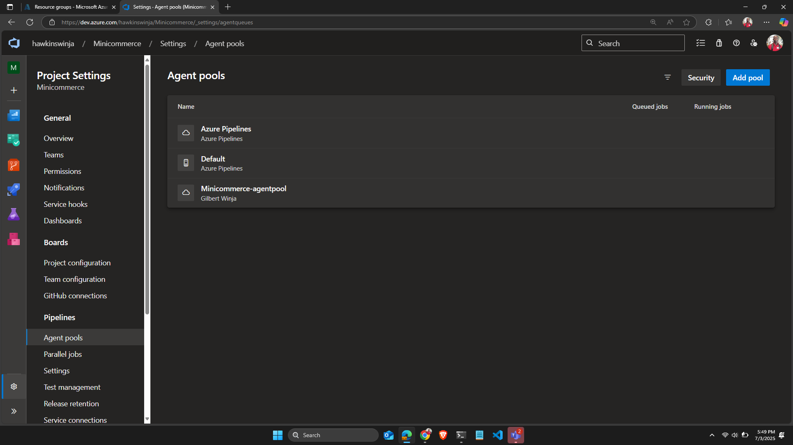
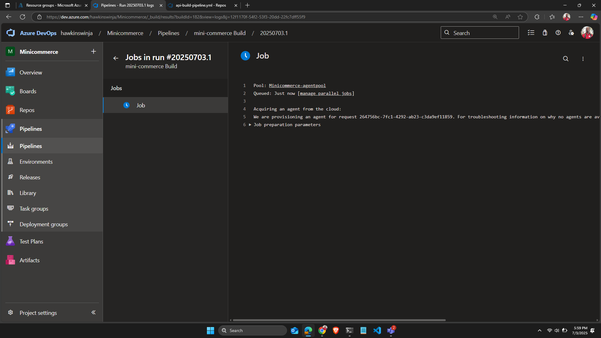
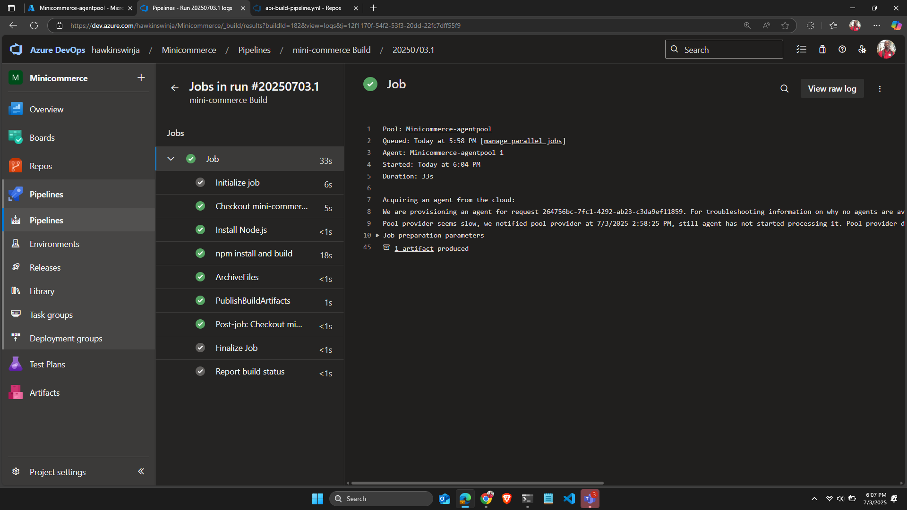

# Azure Managed DevOps Pool

Managed DevOps Pool in Azure allows for the creation of agent pools for self hosted runners on Azure DevOps and GitHub.

This makes it easier to provision and autoscale compute instances on demand compared to configuring custom Virtual Machine Scale Sets.

Read more at [Azure Managed DevOps Pool](https://learn.microsoft.com/en-us/azure/devops/managed-devops-pools/overview?view=azure-devops)

## Prerequisites
1. An active Azure Subscription with compute usage quotas
2. An existing Azure DevOps organization
3. An Existing Project in the Azure DevOps Organization
4. Azure cli with bicep installed (for provisioning the infra)

Run the following command replacing the bracketed values with your own values.
```bash
az group create --name MdpDemo --location westus
az deployment group create --group MdpDemo -u https://github.com/hawkinswinja/crudappautomation/blob/master/infra/modules/mdp.bicep
```
Enter values for organizationUrl (azure devops organization url) and ProjectName (Existing Project in your organization,eg, Minicommerce) and wait for completion.
This creates an agent pool named (ProjectName-agentpool) eg Minicommerce-agentpool

Verify the agentpool is created in your project settings under the agent pools blade.



Trigger a pipeline with the pool set to the name of the agent pool. The initialize process will automatically make a request to azure to provision an agent for use. 
See below. Notice the pool name



Depending on the Agent SKU, The template uses standard B2ms which is burstable, hence takes ~5mins to provision.



Azure will deprovison the resource once the pipeline is complete and no other jobs are in queue, helping to save on cost.
