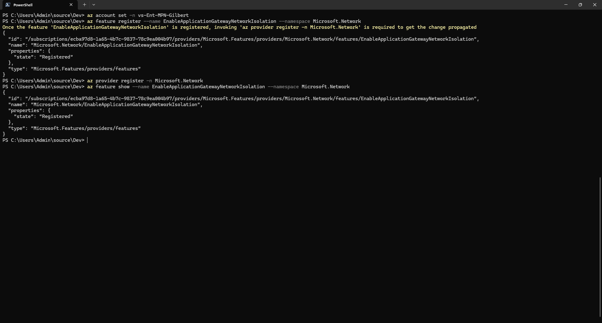
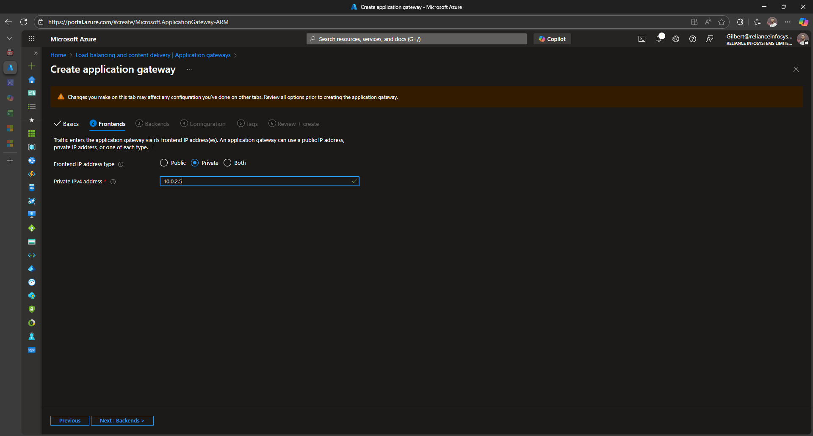

# Provision A Private Application Gateway in Azure
This document provides guidance on how to provision a Private Application Gateway in Azure, ensuring that it is accessible only within a specified Virtual Network (VNet).

For a long time, the Application Gateway has been used as an entry point for applications due to its association with VNet integration and public Ip for the frontend which can be mapped to a DNS record. However, one of the drawbacks to this was azure required providing a public Ip for the frontend even if you did not intend to link this in your configuration (suppose Internal network use cases). By allowing Application Gateways to be provisioned with Private Ips only, this benefits such use cases and even impacts cost for unused provisoned public Ips.
The implementation may change minimally as of writing of this document the use case is still in preview.
## Security Impact
- The Application Gateway will be accessible only via a private endpoint within your VNet, reducing exposure to the internet and minimizing the attack surface.
- All management access must originate from within the VNet (e.g., bastion/jumpbox, VPN, ExpressRoute) or via a peered/linked network; plan secure access, auditing, and jump hosts accordingly.
- Network controls (NSGs, route tables) and Azure policy will apply to traffic directed to and from the Application Gateway.
## Prerequisites
- Azure cli latest and logged in
- Sufficient privileges to register preview features and provision resources
- Existing VNET with a dedicated subnet with cidr range minimimum /27

## Step-by-step Guide
1. **Register the Preview Feature**
   Before creating a Private Application Gateway, you need to register the preview feature in your subscription.

   ```bash
    az feature register --name EnableApplicationGatewayNetworkIsolation --namespace Microsoft.Network
    az provider register --namespace Microsoft.Network
    az feature show --name EnableApplicationGatewayNetworkIsolation --namespace Microsoft.Network
   ```
  

  
   
2. **Provision your application gateway**
   The process remains the same when provisioning an application gateway, the only difference or change occurs when selecting Fontend IP address type, you should have the option for private Ip available as seen below. Assign a static ip from the CIDR of the specified subnet.

   

## Using  your Application gateway

Once the Application Gateway is provisioned with a private IP, you can configure it as you would with any other Application Gateway. Ensure that your backend pools, listeners, and routing rules are set up according to your application's requirements.
