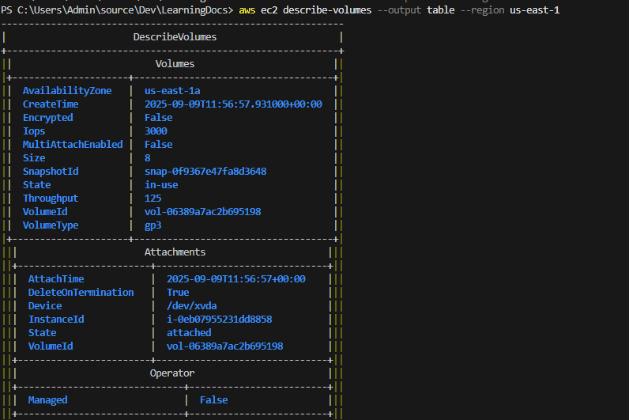
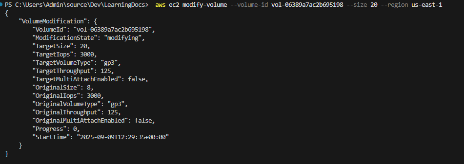
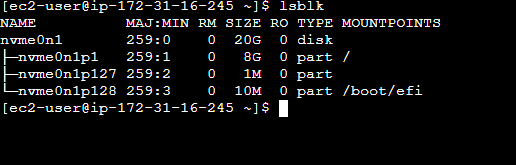
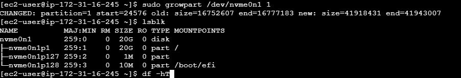
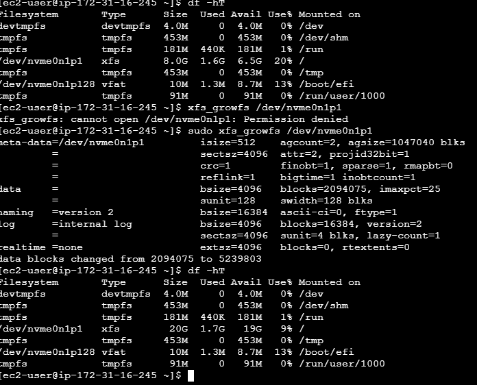

# How to Expand EBS Volume on EC2 Instance Without Restarting (Zero Downtime)

## Prerequisites
- EC2 instance with attached EBS volume
- AWS CLI configured or AWS Console access
- Root/sudo access on the instance

## Step 1: Modify Volume Size (AWS Console)
1. Navigate to EC2 → Volumes
2. Select the volume to expand
3. Actions → Modify Volume
4. Enter new size (must be larger than current)
5. Click Modify

### Modify Volume Size (AWS CLI)
```bash
aws ec2 describe-volumes --output table --region us-east-1
```


```bash
aws ec2 modify-volume --volume-id vol-xxxxxxxxx --size 20 --region 
```
- Note the OriginalSize and TargetSize values



## Step 2: Extend Partition on Instance
Connect to your EC2 instance and run:

### Check current disk layout
```bash
lsblk
df -hT
```


- Notice the volume size of __/dev/nvme0n1__ is 20G, while the root partition __/dev/nvme0n1p1__ is 8G.
- Take note of the file type, in our case this is xfs.

### Extend partition (for most Linux distributions)
```bash
# Rescan for new size
sudo partprobe

# Extend partition (replace /dev/nvme0n1 with your volume mount)
sudo growpart /dev/nvme0n1 1 # extend partition 1 of nvme0n1 volume
```
- The partition __/dev/nvme0n1p1__ is now at 20G



## Step 3: Resize Filesystem

```bash
# Resize filesystem
sudo resize2fs /dev/nvme0n1p1  # For ext4
# OR
sudo xfs_growfs /dev/nvme0n1p1  # For XFS
```
### Verify Expansion
```bash
df -h
```
- Compare the size of __/dev/nvme0n1p1__ in the output of __df__ command, before and after running **xfs_growfs**




## Important Notes
- Volume modification may take several minutes
- No downtime required for most volume types
- Always backup data before modifying volumes
- Cannot decrease volume size, only increase